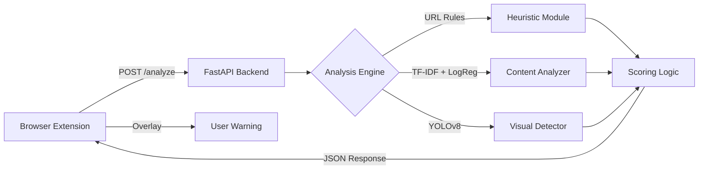

# 🛡️ PhishGuard Project Status Report

**Date:** November 24, 2025
**Version:** 1.0
**Status:** Active Development

## 1. Executive Summary
PhishGuard is a functional AI-powered browser extension designed to detect and block phishing attempts in real-time. The system utilizes a hybrid approach combining heuristic analysis, NLP-based content scanning, and computer vision (YOLOv8) to assess threat levels.

The project is currently in a **stable state** with a working end-to-end pipeline:
- **Extension**: Fully functional (Manifest V3), injects content scripts, and displays warnings.
- **Backend**: FastAPI server handles analysis requests with sub-second latency (typically).
- **Detection**: All three detection layers (Heuristic, Content, Visual) are integrated and contributing to the final "Trust Score".

## 2. System Architecture

### High-Level Flow

### Core Components

| Component | Technology | Status | Key Responsibility |
|-----------|------------|--------|--------------------|
| **Extension** | JS, HTML5, CSS3 | 🟢 Active | Captures URL/HTML/Screenshot, displays UI. |
| **Backend API** | Python, FastAPI | 🟢 Active | Orchestrates analysis, serves static assets. |
| **Heuristic** | Python | 🟢 Active | Checks URL patterns (IPs, length, subdomains). |
| **Content AI** | Scikit-learn | 🟢 Active | Detects urgency & suspicious keywords in text. |
| **Visual AI** | YOLOv8 + OpenCV | 🟢 Active | Identifies brand logos to detect impersonation. |

## 3. Component Status Details

### 🌐 Browser Extension
- **Manifest Version**: V3
- **Permissions**: `activeTab`, `scripting`
- **Host Permissions**: `http://127.0.0.1:8000/*`
- **Key Files**:
    - `content.js`: Scrapes page content and sends to backend.
    - `background.js`: Service worker (minimal logic in V3).
    - `popup.html/js`: User interface for manual scans and status.
    - `warning.html`: Blocking overlay for dangerous sites.
- **Recent Updates**:
    - **UI Overhaul**: Switched to "Manrope" font, modernized color palette (Green/Red/Yellow indicators).
    - **Icon**: Updated to new custom logo.
    - **UX**: Fixed scrollbar issues and pixelation artifacts.

### 🧠 Backend Engine
- **Server**: Uvicorn + FastAPI
- **Endpoint**: `POST /analyze`
- **Logic (`main.py`)**:
    - **Weighted Scoring**:
        - If URL Score > 80: Max of (URL, Content, Visual)
        - Else: Weighted average (URL 20%, Content 50%, Visual 30%)
    - **Visual Veto**: If content looks safe (< 5) but visual is suspicious (50-80), visual weight is reduced to prevent false positives on legitimate sites with logos.
    - **Thresholds**:
        - **Phishing**: Score >= 75
        - **Suspicious**: Score >= 45
        - **Safe**: Score < 45

## 4. Recent Technical Changes
1.  **Visual Veto Logic**: Added logic in `main.py` to reduce false positives where a logo is detected on a safe page (e.g., a tech blog discussing Google).
2.  **UI Polish**:
    - Removed default scrollbars in `popup.html`.
    - Improved font rendering with `antialiased` text.
    - Standardized button styles with hover effects.
3.  **Test Infrastructure**:
    - Verified `test_google.html` and `test_netflix.html` serve correctly from backend.
    - Confirmed `visual_trap.html` triggers visual detection logic.

## 5. Current Configuration
- **Local Server**: `http://127.0.0.1:8000`
- **YOLO Model**: `yolov8n.pt` (Nano model for speed)
- **Content Model**: `content_model.joblib` (Logistic Regression)
- **Logging**: INFO level enabled for tracking analysis flow.

## 6. Recommendations & Next Steps
- **Performance**: Monitor latency of the YOLO model on lower-end hardware.
- **False Positives**: Continue tuning the "Visual Veto" logic based on real-world usage.
- **Deployment**: Consider containerizing the backend (Dockerfile exists) for easier deployment.
- **HTTPS**: Extension currently communicates over HTTP to localhost; production would require HTTPS.
